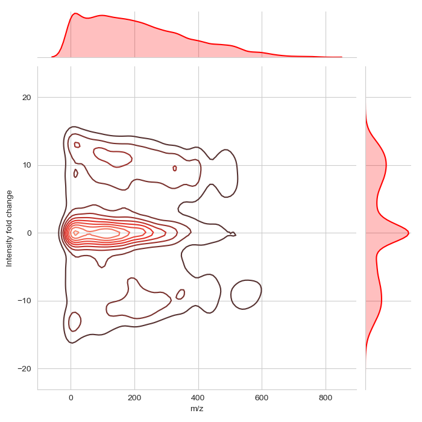

# Notebook for quandenser-pipline project

## 2019-05-17b Biases in BoxCar individual isolation window efficiency

I repeated the experiment, but this time just investigating the area around each isolated peak (Assuming > 5Th windows between isolated peaks). No luck this time either.
[./isolationwindow/isolationwin.py](./isolationwindow/isolationwin.py)

--LK

## 2019-05-17 Biases in BoxCar window efficiency

Anecdotal evidence suggested that BoxCar windows are biased, in that they were samplling with different efficeny for different m/z regions. We first set out to investigate this effect on a global scale by comparing all the ms1-peaks in one run to its closest boxcar peaks.
[./boxcarbias/boxcarwin.py](./boxcarbias/boxcarwin.py)

We saw no particular bias.
--LK
